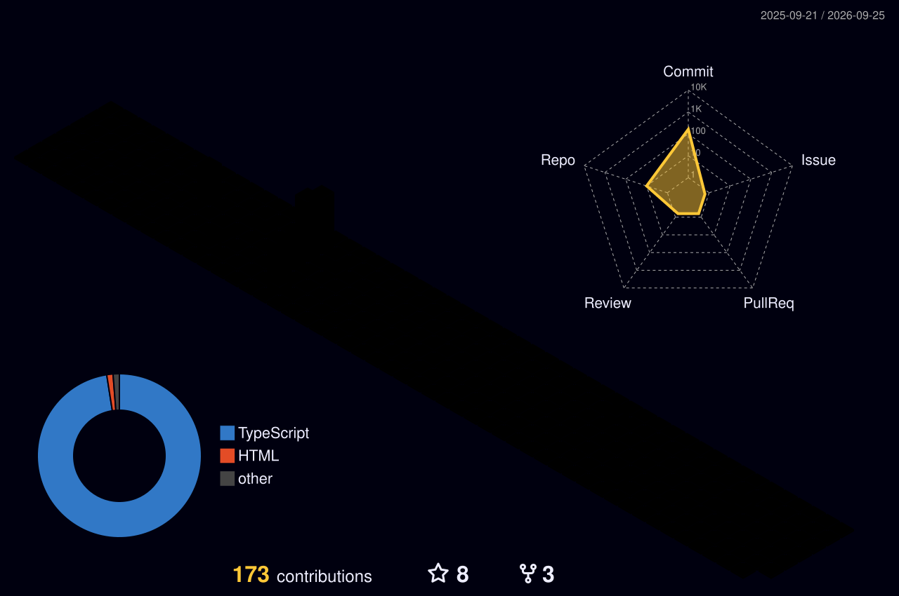

<h1 align="center">G1 Creative</h1>

  I build fast, clean websites and web apps for real businesses. 
  TypeScript · React · Next.js

  <a href="https://advancedrestoration.net">advancedrestoration.net</a> ·
  <a href="https://leagueville.vercel.app">leagueville</a> ·
  <a href="mailto:g1.creative.web@gmail.com">g1.creative.web@gmail.com</a>

---

### 🐍 Watch the snake eat my commits

<picture>
  <source media="(prefers-color-scheme: dark)" srcset="https://raw.githubusercontent.com/g1-creative/g1-creative/output/snake-dark.svg">
  <source media="(prefers-color-scheme: light)" srcset="https://raw.githubusercontent.com/g1-creative/g1-creative/output/snake.svg">
  
</picture>

---

### 📊 Stats

### 📅 Commits, isometric

### 🌆 Commits, in 3D

---

Everything on this page regenerates itself daily via GitHub Actions.

